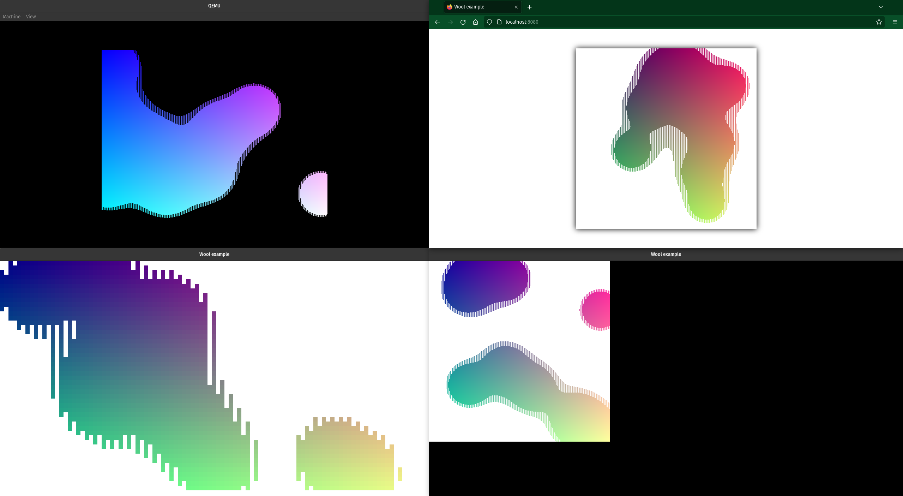

<h1 align="center">
  Soft - a software renderer (GPU is not used)
</h1>

<h3 align="center">
  <i>Drawing graphics anywhere!</i>
</h3>

<p align="center">
  
  <p align="center">
    <i><b>The <a href="examples/metaballs.zig">metaballs</a> example running in the UEFI (TODO: build.zig broken ATM), on the web, in the terminal, and natively using OpenGL</b></i>
  </p>
</p>

## Usage

For now, until we have a [package manager](https://github.com/ziglang/zig/issues/943), copying this directory (not just `src/` as it doesn't include `LICENSE`)
into a `lib/` of yours might have to do. You can do something like this in your `build.zig`:
```zig
    exe.addPackagePath("soft", "lib/src/main.zig");
```

## Building & Running examples

Run `zig build --help` and see `Project-Specific Options`:
```
  -Dexample=[string]           The example to run (pass "help" for a list)
  -Dbackend=[string]           The backend to use for examples and tests:
                               none, opengl, terminal, uefi, vulkan, web (default: terminal)
```

This means e.g. `zig build run -Dexample=rectangle -Dbackend=terminal` will build and run the `examples/rectangle.zig` example in your terminal (Ctrl+C to quit).

## Goals

* Have a simple, portable way to show graphics on the screen, using the CPU.
* Easy integration into any environment.
* Ability to test graphics output:
  Often in graphics and video games it's hard to test output accurately.
  Soft being a software renderer, it's easy to accurately test graphics output. The GPU is not used and all pixels are rendered by hand.
* Reusability and flexibility:
  As an example, a single `drawRect` serves to draw rectangles with solid colors, gradients, rounded corners, everything.
  All this keeps the library small yet powerful.

## Application

* **Video games**:
  Soft provides a lot of primitives for making video games.
* **Embedded**:
  The microcontroller you're developing for may not have a GPU.
* **GUIs**:
  Soft provides a solid base for creating graphical user interfaces.
* **Emulators**:
  Many older systems work in a similar fashion to framebuffers and didn't use GPUs as advanced as we have them today.
  This means Soft might be a good fit for emulators.
* **Prototyping and experimentation**:
  Soft is very easy to use and quickly lets you draw something to the screen.
  This makes Soft an excellent candidate for experiments.
  A great example of this use case in practice can be found at `examples/`.

## Why do the drawing on the CPU instead of the GPU?

* Simplicity
* More control, over every pixel
* Portability
* A GPU may not be available
* You know exactly what's happening

## FAQ

### Question

Why are the example backends not part of Soft itself?
So that I doesn't have to copy the example backend that renders the grid into my app for my platform/environment?

### Answer

This is because doing so would be a monumental task and significantly increase complexity.
For example, if the Vulkan example backend would be a backend as part of the Soft library itself:
how would we ever provide enough control over what's happening inside the backend for every use case?
The Vulkan API gives the user a ton of control that we would have to pass through our abstraction.
Or for Wasm: how would we include the JavaScript that interpolates the memory it gets from
Zig through Wasm as an image in the Soft library and make it so that the user has enough control over it?

All this is why platform/environment-specific backends stay out of the Soft library itself and drawing the grid is left to the user.
As always, you can take inspiration from the example backends for rendering your grid in your environment.
This is one thing Soft does not do for you out of the box.
